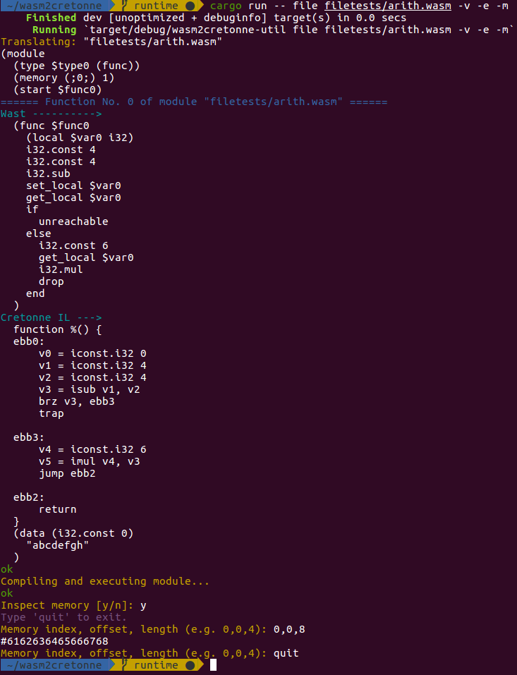

# wasm2cretonne

[Cretonne](https://github.com/stoklund/cretonne) frontend for WebAssembly. Reads wasm binary modules and translate the functions it contains into Cretonne IL functions.

The translation needs some info about the runtime in order to handle the wasm instructions `get_global`, `set_global`, and `call_indirect`. These informations are included in structs implementing the `WasmRuntime` trait like `DummyRuntime` or `StandaloneRuntime`.


The `StandaloneRuntime` is a setup for in-memory execution of the module just after translation to Cretonne IL. It allocates memory for the wasm linear memories, the globals and the tables and embeds the addresses of these memories inside the generated Cretonne IL functions. Then it runs Cretonne's compilation, emits the code to memory and executes the `start` function of the module.

## API

Use the functions defined in the crates `wasm2cretonne` and `wasmruntime`.

### Example

```rust
use wasm2cretonne::translate_module;
use wasmruntime::{StandaloneRuntime, execute_module};
use std::path::{Path, PathBuf};

fn read_wasm_file(path: PathBuf) -> Result<Vec<u8>, io::Error> {
    let mut buf: Vec<u8> = Vec::new();
    let file = File::open(path)?;
    let mut buf_reader = BufReader::new(file);
    buf_reader.read_to_end(&mut buf)?;
    Ok(buf)
}

let path = Path::new("filetests/arith.wasm");
let data = match read_wasm_file(path.to_path_buf()) {
    Ok(data) => data,
    Err(err) => {
        panic!("Error: {}", err);
    }
};
let mut runtime = StandaloneRuntime::new();
let translation = match translate_module(&data, &mut runtime) {
    Ok(x) => x,
    Err(string) => {
        panic!(string);
    }
};
execute_module(&translation);
println!("Memory after execution: {:?}", runtime.inspect_memory(0,0,4));
```

## CLI tool

The binary created by the root crate of this repo is an utility to parse, translate, compile and execute wasm binaries using Cretonne. Use `--help` to lookup its options.

The tool only reads binary WebAssembly so you'll have to manually encode your source files with the [WebAssembly binary toolkit](https://github.com/WebAssembly/wabt).

### Example


